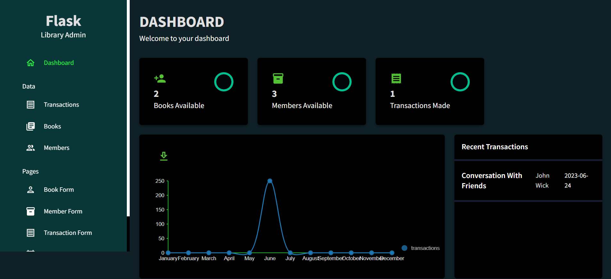

# Library Management System Admin Panel

This project is an admin panel for a library management system. It provides a user-friendly interface to perform CRUD (Create, Read, Update, Delete) operations on books, members, and transactions. The website is built using ReactJS for the frontend and Flask for the backend.

## Features

- Dashboard with charts and statistics to visualize library data.
- Manage books: Add new books, update book information, and delete books from the library.
- Manage members: Add new members, update member information, and delete members from the system.
- Manage transactions: Issue books to members, return books to the library, and view transaction history.
- Integration with Material-UI for enhanced UI components and styling.
- Responsive design for optimal user experience on different devices.

    
    
    

## Technologies Used

- ReactJS: A JavaScript library for building user interfaces.
- Flask: A Python web framework for building the backend server.
- Material-UI: A popular React UI framework for creating visually appealing and responsive designs.
- Charts: Integration of charting libraries like Chart.js or Recharts for data visualization.
- Database: Integration with a database system (SQL) to store and retrieve library data.

    
    
    

## Installation and Setup

### Prerequisites

- Node.js: Make sure you have Node.js installed on your machine.
- Python: Install Python and pip for installing Flask and other Python dependencies.

### Frontend Setup

1. Clone the repository:
git clone <repository_url>

2. Navigate to the frontend directory:
cd react-admin-dashboard-master

3. Install dependencies:
npm install

4. Start the frontend development server:
npm start

5. The frontend server will start running on `http://localhost:3000`.

### Backend Setup

1. Navigate to the backend directory:
cd api

2. Create a virtual environment:
python -m venv venv

3. Activate the virtual environment:
   - For Windows:
   venv\Scripts\activate
   - For macOS/Linux:
   source venv/bin/activate

4. Install the Python dependencies:
pip install -r requirements.txt

5. Start the Flask development server:
flask run

6. The backend server will start running on `http://localhost:5000`.

## Configuration

You may need to configure the backend server to connect to your preferred database system. Update the database settings in the `config.py` file located in the backend directory.

## Usage

1. Open your web browser and go to `http://localhost:3000` to access the library management system admin panel.

2. Use the provided functionality to manage books, members, and transactions.

## Contributing

Contributions are welcome! If you have any suggestions, improvements, or bug fixes, please submit a pull request.

## License

This project is licensed under the [MIT License](LICENSE).

